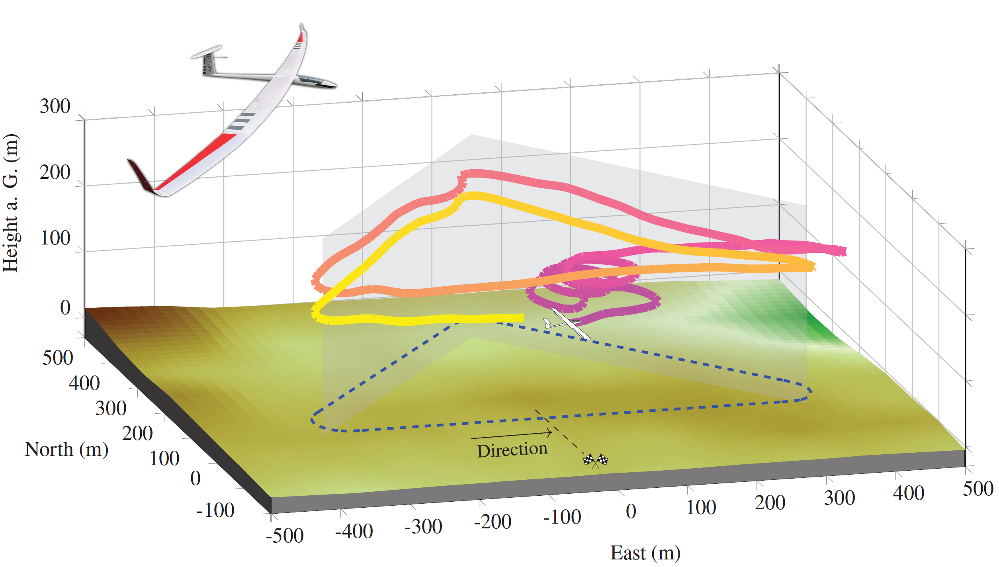

## Hierarchical Reinforcement Learning Framework for Autonomous  <br/> Cross-Country Soaring 

### Overview
Autonomous soaring constitutes an appealing task for applying reinforcement learning methods within the scope of guidance, navigation, and control for aerospace applications. 
Cross-country soaring embraces a threefold tactical decision-making dilemma between covering distance, exploiting updrafts, and mapping the environment. The need for trading short-term rewarding actions against actions that pay off in the long-term makes the task particularly suited for applying reinforcement learning methods.

This repository includes a reinforcement learning framework for solving the tactical decision-making problem subject cross-country soaring (by the example of the competition task of [GPS Triangle](https://gps-triangle.net/) racing). The framework was developed by researchers at the [Institute of Flight Mechanics and Controls (iFR)](https://www.ifr.uni-stuttgart.de/) at the University of Stuttgart. Alongside our [Particle-Filter-Based Multiple Updraft Estimator](https://github.com/ifrunistuttgart/ParticleFilter_UpdraftEstimator), the resultant overall policy was implemented on embedded hardware aboard an autonomous soaring aircraft and successfully flight-tested.



More detailed information about the hierarchical reinforcement learning approach, the implementation, and the flight test results can be found in the associated paper listed below.

### Getting started
This repository contains the full source code, which was used to train the agent. 
The *glider* training environment is an extension of the [OpenAI gym](https://gym.openai.com/) library. 
It implements a novel three degrees of freedom (3 DoF) model of the aircraft dynamics in the presence of an arbitrary wind field.
 
#### Prerequisites
To run the training environment, you need to install a virtual Python 3.8 environment with the following packages:
gym (0.17.1), 
pytorch (1.4),
numpy (1.12.3),
scipy (1.6.2),
pandas (1.1.3) and
matplotlib (3.4.3).

To register the gilder module in your virtual environment, run the following command inside this project folder: 
```
pip install -e glider
```


### Credits
If you like to use our work or build upon the algorithms in an academic context, please cite:

>Notter, S., Schimpf, F., & Fichter, W., "Hierarchical Reinforcement Learning Approach Towards Autonomous Cross-Country Soaring," AIAA SciTech 2021 Forum. https://doi.org/10.2514/6.2021-2010
